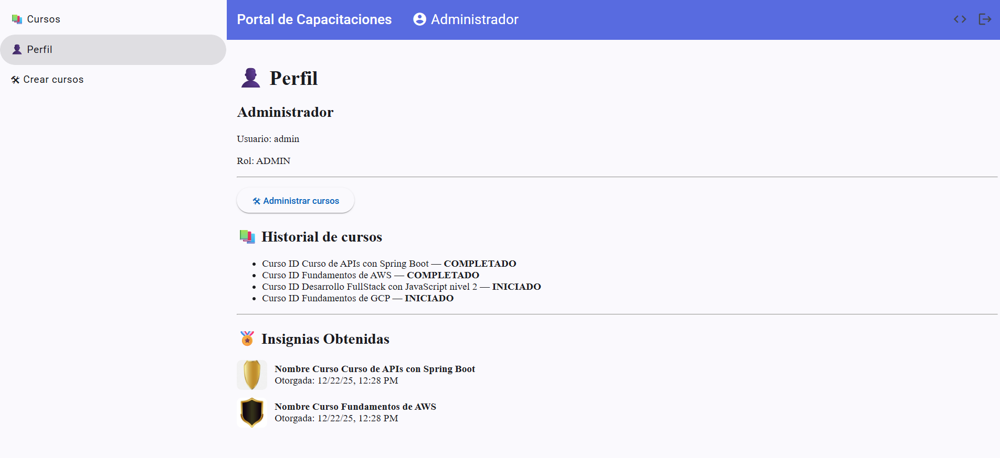
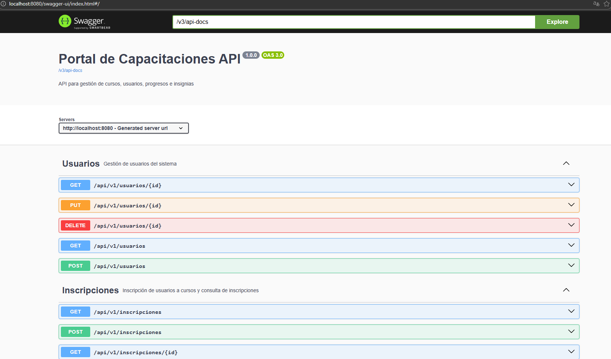

# Portal de Capacitaciones

Aplicación fullstack para gestión de cursos y capacitaciones.

## 📄 Documentación API (Swagger / OpenAPI)

El backend expone su documentación interactiva mediante **Swagger (OpenAPI 3)**, lo que permite:

- Explorar todos los endpoints disponibles
- Ver los modelos de request y response
- Probar las APIs directamente desde el navegador
- Facilitar la integración con el frontend y pruebas manuales

### 🔗 Portal de capacitaciones
Vista del panel principal:

### 🔗 Acceso a Swagger UI
Una vez levantado el backend, la documentación está disponible en:

http://localhost:8080/swagger-ui.html

La documentación se genera automáticamente a partir de los controladores del backend y se mantiene sincronizada con el código.

## 🧩 Stack
- Backend: Java 17, Spring Boot, JPA, PostgreSQL
- Frontend: Angular 17+, Angular Material
- Auth: Login simple contra DB
- Roles: ADMIN / USER

## 🔐 Usuarios de prueba
ADMIN  
- user: admin  
- pass: admin  

USER  
- user: andres  
- pass: 123456  

## 🚀 Funcionalidades
- Login real
- Protección de rutas
- CRUD de cursos (ADMIN)
- Visualización de cursos (USER)
- Perfil con historial e insignias

## ▶️ Ejecutar proyecto completo (Docker)
docker-compose up -d --build
